# 🥤 Vending Machine - Java Implementation (State Design Pattern)

This project is a **Vending Machine** simulation implemented in Java using the **State Design Pattern**. It demonstrates how a vending machine transitions between states based on user actions, handles money, dispenses items, and returns change.

---

## ✅ Features
- Insert coins (`NICKEL`, `DIME`, `QUARTER`)
- Select an item (`Coke`, `Pepsi`, `Soda`)
- Dispense item and return change if any
- Cancel transaction and return inserted coins
- Inventory management for items and coins
- Modular state-based design

---

## 📁 Classes Overview

### Core Interfaces & Classes:
- `VendingMachine`: Interface for vending operations
- `VendingMachineImpl`: Main implementation that manages states and transitions

### State Pattern:
- `State`: Interface for state behavior
- `IdleState`: Waiting for coins
- `HasMoneyState`: Coins inserted, waiting for selection
- `DispensingState`: Handles item dispensing and change

### Support Classes:
- `Item`: Represents a product (name + price)
- `Coin`: Enum for accepted coin types and values
- `Inventory`: Tracks available items
- `Transaction`: Temporarily holds inserted coins and selected item

---

## 🔄 State Transition Flow

```mermaid
stateDiagram-v2
    [*] --> IdleState
    IdleState --> HasMoneyState : insertCoin
    HasMoneyState --> DispensingState : selectItem
    DispensingState --> IdleState : dispense & reset

    HasMoneyState --> IdleState : cancel → return coins
```



## Design Principles
- ```State Pattern for managing machine behavior transitions```

- ```Separation of Concerns: Inventory, Transaction, and State behaviors are isolated```

- ```Extensibility: Easily add new states, coins, or products```